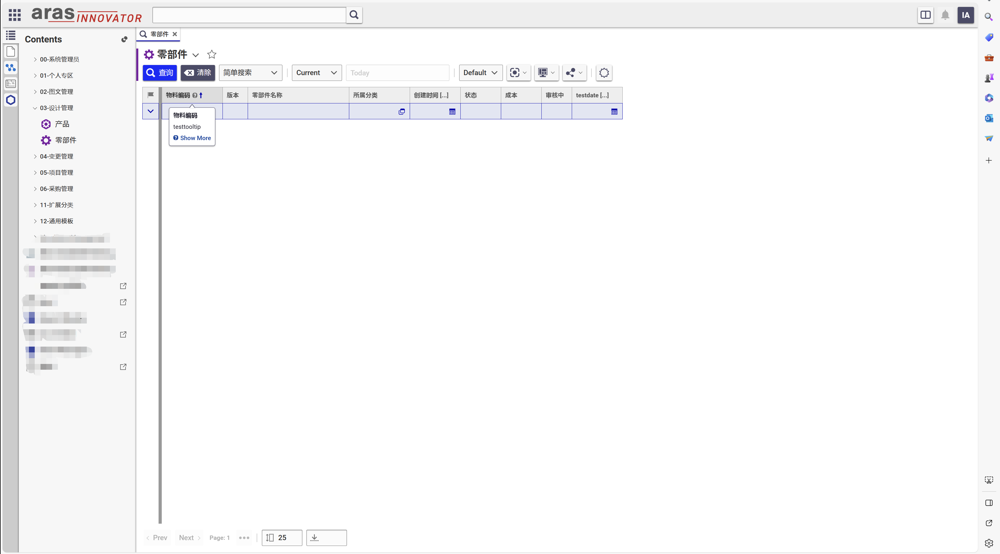
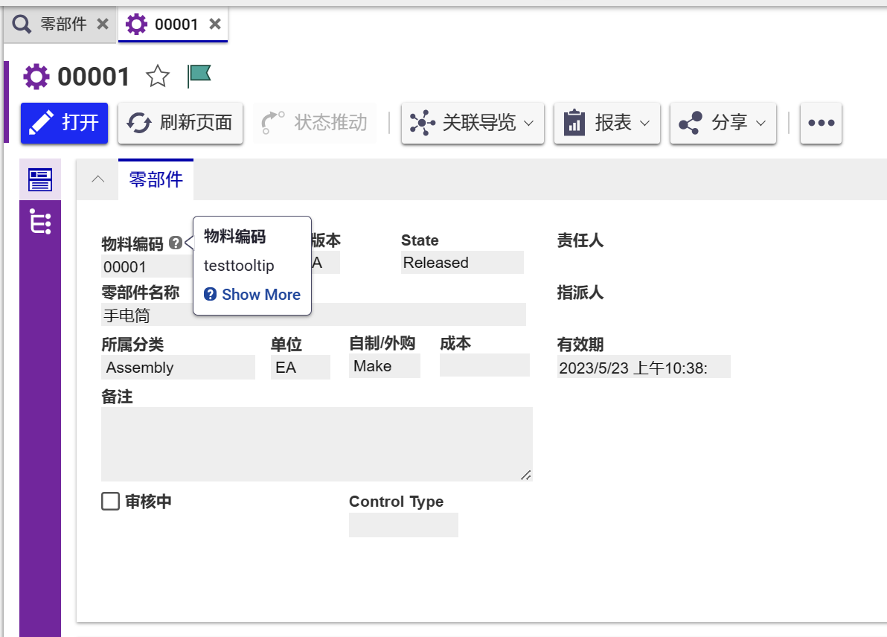

# Aras Innovator 帮助提示

从Aras Innovator 27版移植而来的帮助提示功能,可在窗体控件/查询表格/关系表格中鼠标经过对应控件时显示提示信息

## 支持系统版本

Project | Aras
--------|------
[v1.0.0](https://github.com/tengzhuang1/ArasTooltipHelp/releases/tag/v1.0.0) | Aras 2023 Release Build 14.0.9.36244

## 安装

### 必备条件

1. Aras Innovator 已安装
2. Aras Package Import 导入工具

### Code tree 安装步骤

1. 备份您的CodeTree并存储在安全的地方
2. 打开本地 `..\ArasTooltipHelp\` 文件夹
3. 复制 `\Innovator\` 文件夹
4. 将其粘贴到Aras安装目录的根目录
    + 默认情况下路径为 `C:\Program Files\Aras\Innovator\`

### Database 安装步骤

1. 备份您的数据库并将BAK文件存储在安全的地方
2. 打开 Aras Package Import 工具
3. 输入Aras Innovator系统地址并点击 **Login**
4. 在弹出的登录页面中输入登录信息
    * 须使用 **root** 用户登录
5. 在 **TargetRelease** 控件中输入**包**的名称(可随意填写,建议填写 `ArasTooltipHelp`)
    * 可选: 在 **Description** 控件中填写描述信息
6. 在 **Path** 控件中输入本地安装包路径 `..\ArasTooltipHelp\Imports\imports.mf` 
7. 在 **Available for Import** 控件中勾选 **com.aras.innovator.solution.tooltiphelp**
8. 选择 Type = **Merge** , Mode = **Thorough Mode**
9. 点击顶部左侧 **Import**
10. 等待导入成功后关闭 Aras Package Import 工具

## 功能配置
1. 使用管理员账户登录Aras
2. 打开任意对象类,在`属性`页签中挑选任意属性,填写**提示**与**帮助文本**
3. 打开对象类窗体
4. 切换至窗体 `控件标签(Field Label)` 页签
5. 勾选 `Show Help`
    * 勾选后,鼠标经过对应控件时,将显示提示信息
    * 默认为已勾选状态

⚠️ 注意: `Show Help` 勾选后并保存后会一直显示未勾选状态,但实际已经勾选上了的,如果要取消勾选就先勾上然后再取消勾选再保存;会出现这样的情况是因为.....(原因太长懒得写 -,,- )

## 使用
1. 在TOC中打开有配置了帮助提示的对象类查询页面
2. 鼠标经过对应控件时,将显示提示信息
3. 点击提示信息框中的 `Show More` 按钮,将显示帮助文本
4. 打开对象窗体页面
5. 鼠标经过对应控件时,将显示提示信息
6. 点击提示信息框中的 `Show More` 按钮,将显示帮助文本

⚠️ 注意: 弹窗查询页面与关系查询页面暂无法使用,待后续进行完善

## 技术交流 📣
[QQ群:197823386](http://qm.qq.com/cgi-bin/qm/qr?_wv=1027&k=9QBAR-Ra85m9l3GUxCX49rRFPWLs87FG&authKey=kdr98tqLBx2rF5swIO5%2BiKGQRJdLt8DZ5t2sSHY8pWfHhmjAioXEfWJfs4wShNfJ&noverify=0&group_code=197823386)